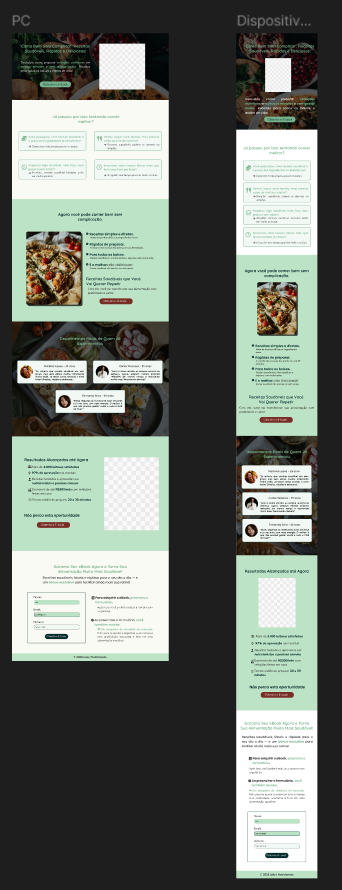
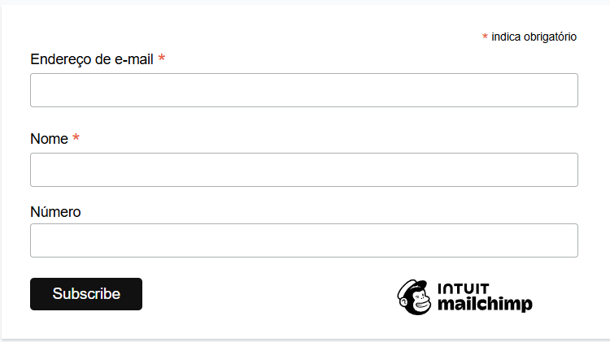
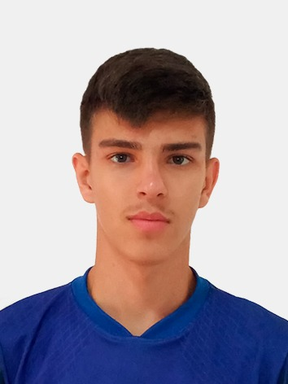
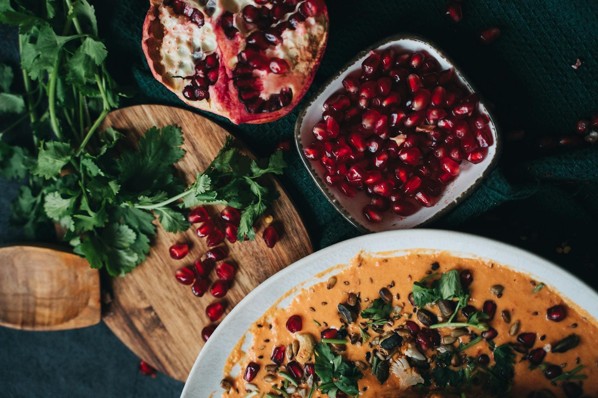
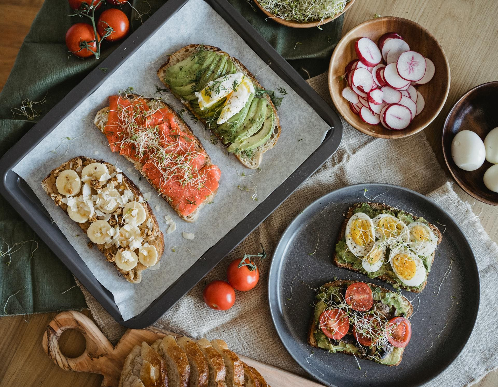
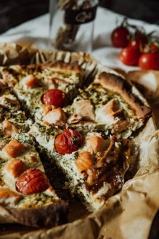

[HTML__BADGE]: https://img.shields.io/badge/html5-%23E34F26.svg?style=for-the-badge&logo=html5&logoColor=white 
[CSS__BADGE]: https://img.shields.io/badge/css3-%231572B6.svg?style=for-the-badge&logo=css3&logoColor=white
[MIT__BADGE]: https://img.shields.io/github/license/Naereen/StrapDown.js.svg

<h1 align="center" style="font-weight: bold;">📓 Landing Page de Alta Conversão - Ebook</h1>

![html][HTML__BADGE]
![css3][CSS__BADGE]
![mit][MIT__BADGE]

  <a href="#sobre">Sobre</a> • 
  <a href="#acesso">Acesse Aqui</a> • 
  <a href="#design">Design</a> •
  <a href="#mobile">Mobile</a> •
  <a href="#mailchimp">Mailchimp</a> • 
  <a href="#contribuidores">Contribuidores</a> • 
  <a href="#creditos">Fontes e Créditos</a> •
  <a href="#licenca">Licença</a>

 

    

 

<h2 id="sobre">📌 Sobre</h2>

Uma Landing Page de Alta Conversão de um E-book de receitas saudáveis com <strong>integração com Mailchimp</strong>, no qual o formulário, integrado do mailchimp, é personalizado. Este projeto foi realizado com <strong>HTML</strong> e <strong>CSS</strong>, usando a prática <strong>Mobile Firs</strong> e <strong>Versionamento Git</strong>.

 
 

<h2 id="acesso">🚀 Acesse o Projeto</h2>

Veja o projeto você mesmo: <a href="#" target="_blank">LP Ebook</a>

 
 

<h2 id="design">🎨 Design</h2>

O desing do site foi feito por mim. Foi utilizado o <strong>Figma</strong> para realização do desing.

Segue o link do projeto no figma: <a href="https://www.figma.com/design/GXrtfM06RepsJXAcZJ6dHU/LP-Alta-Convers%C3%A3o?node-id=0-1&m=dev">LINK FIGMA</a>

<strong>Senha:</strong> LP_Ebook

<strong>OBS: </strong>Por favor, <ins>não adicionar comentários!</ins>

 
 

<h2 id="mobile">📱 Mobile</h2>

O site foi feito com a prática <strong>Mobile First</strong>, sendo realizado primeiro para as telas menores (celulares) e depois expandido para telas maiores.

<strong>Exemplos:</strong>

    
    

    
    

    
    

 
 

<h2 id="mailchimp">📝 Mailchimp</h2>

O <strong>formulário</strong> do site é <strong>integrado ao Mailchimp</strong>. Ele foi criado dentro da plataforma e depois adicionado ao site por meio da opção de incorporação.

A aparência do <strong>formulário</strong> não é a padrão oferecida pelo Mailchimp, foi <strong>personalizada</strong> com CSS para combinar com o design do site.

O <strong>funcionamento continua o mesmo</strong>: sempre que alguém preenche o formulário, os dados são enviados para o Mailchimp e o visitante recebe um e-mail de confirmação automática.

<table align="center">
    <tr>
        <td>
            <h4>Este é o formulário padrão do Mailchimp:</h4>
            
        </td>
        <td>
            <h4>Este é o formulário personalizado:</h4>
            
        </td>
    </tr>
</table>

 
 

<h2 id="contribuidores">🤝 Contribuidores</h2>

Um agradecimento especial ao Luis Otávio, que criou as imagens do E-book.

<table>
  <tr>
    <td align="center">
      <a href="https://www.instagram.com/luiss_domingos/">
         
        
          <b>Luis Otávio C. Domingos</b>
        
      </a>
    </td>
  </tr>
</table>

<h2 id="creditos">📚 Fontes & Créditos</h2>

Todas as imagens do site foram obtidas através do banco de dados gratuito <a href="https://www.pexels.com/pt-br/">Pexels</a>. Segue os créditos:

<table>
  <tr>
    <td align="center">
      <a href="https://www.pexels.com/pt-br/foto/comida-alimento-refeicao-saudavel-6544493/">
         
        
          <b>Foto de Alesia Kozik</b>
        
      </a>
    </td>
    <td align="center">
      <a href="https://www.pexels.com/pt-br/foto/pao-comida-alimento-refeicao-7936740/">
         
        
          <b>Foto de Nicola Barts</b>
        
      </a>
    </td>
    <td align="center">
      <a href="https://www.pexels.com/pt-br/foto/pizza-com-tomate-e-queijo-em-papel-branco-6072220/">
         
        
          <b>Foto de Alesia Kozik</b>
        
      </a>
    </td>
    <td align="center">
      <a href="https://www.pexels.com/pt-br/foto/foto-de-close-up-de-mulher-rindo-com-uma-blusa-de-bolinhas-brancas-e-pretas-3042160/">
         
        
          <b>Foto de Caio</b>
        
      </a>
    </td>
    <td align="center">
      <a href="https://www.pexels.com/pt-br/foto/retrato-sorridente-sorrindo-maos-juntas-9271180/">
         
        
          <b>Foto de Ajan Yogi</b>
        
      </a>
    </td>
    <td align="center">
      <a href="https://www.pexels.com/pt-br/foto/mulher-usando-chapeu-marrom-654696/">
         
        
          <b>Foto de Min An</b>
        
      </a>
    </td>
  </tr>
</table>

Todos os ícones presentes no site são do <a href="https://fontawesome.com/icons">FontAwesome</a>, são todos gratuitos.

E as fontes do site são do <a href="https://fonts.google.com/">Google Fonts</a>, sendo elas: 

<ul>
  <li>Quicksand
  <li>Poppins
  <li>Nunito
  <li>Work Sans
</ul>

 
 

<h2 id="licenca">📃 Licença</h2>
Veja a lincença do projeto: <a href="https://github.com/JoaoVitorDomingos/LP-eBook?tab=MIT-1-ov-file">MIT License</a>

 
 
